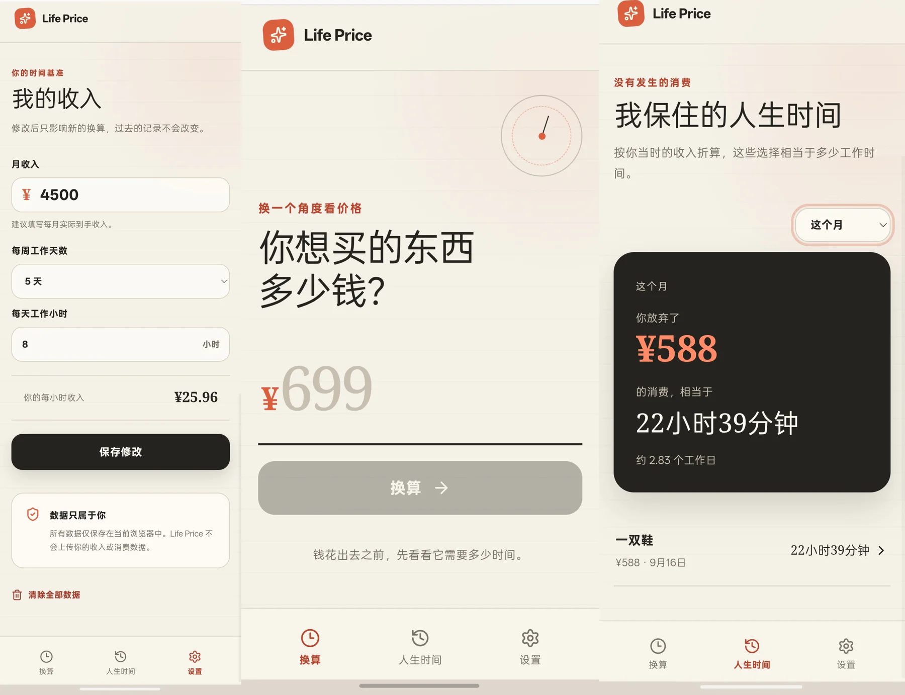

# Life Price

把商品价格换算成需要付出的工作时间，让消费成本变得更具体。

> Status: V1 / Live

## Live Demo

[Open Production](https://life-price-jocelin3.vercel.app)

## Portfolio

[Things I Wish Existed](https://things-i-wish-existed.vercel.app)

---

## Overview

Life Price 不只显示一件商品多少钱，还会告诉用户需要用多少工作时间去交换。用户先设置自己的收入与工作节奏，再输入价格，产品会给出对应的工作小时和工作日。换算结果继续推进到“值得交换 / 算了”的真实决策，而不是停留在一个数字上。

---

## Screenshots



---

## Core Features

- 根据月收入、每周工作天数和每天工作小时建立个人时薪基准
- 将商品价格换算成工作时间和工作日
- 可选计算单次使用成本与单次等价工作时间
- 通过“值得交换 / 算了”推进消费决策
- 保存选择“算了”的消费记录，并按月份汇总保住的金钱与时间
- 编辑收入设置、删除单条记录或清空本地数据
- 使用 localStorage 在当前浏览器持久化设置与记录

---

## Product Decisions / Build Notes

### 1. 用真实工作节奏建立时薪基准

**Decision**  
不采用“月收入 ÷ 30”的简单估算，而是结合每周工作天数和每天工作小时计算个人时薪。

**Reason**  
相同月收入背后可能对应完全不同的工作投入，只有纳入工作节奏，换算结果才接近用户真实付出的时间。

**Result / Trade-off**  
首次使用需要多填写两个字段，但换算语义更准确。

### 2. 历史记录保留当时的决策语境

**Decision**  
修改收入或工作节奏后，只影响未来的新换算，不重算已有记录。

**Reason**  
历史记录表达的是用户当时做决定时的收入基准和时间成本。

**Result / Trade-off**  
新旧记录可能采用不同基准，但每条记录都保留了原始决策语境。

### 3. 让计算结果进入真实选择

**Decision**  
将“值得交换 / 算了”设计成换算后的下一步，而不是装饰按钮。

**Reason**  
产品价值不只是给出公式结果，还要把数字转化成用户能理解并采取行动的决策语言。

**Result / Trade-off**  
V1 只保存选择“算了”的记录，保持历史页聚焦于没有发生的消费。

### 4. 建立正式发布链路

**Problem**  
项目需要从原托管环境迁移到稳定的 Production 发布流程。

**Solution**  
使用 Next.js 静态导出适配 Vercel，并建立 GitHub → Vercel 自动部署。

**Result**  
Production 由仓库分支驱动，后续代码更新可以沿用同一发布链路。

---

## What I Learned

- 计算器产品的关键不只是公式，还包括怎样把结果转成可理解的决策语言。
- 历史数据不一定应该跟随最新设置重算，数据语义比“始终保持最新”更重要。
- 跑通了 GitHub、分支、PR、Vercel Production 与自动部署的基本工作流。

---

## Tech Stack

- React
- TypeScript
- Next.js（静态导出）
- Vinext（本地开发工具链）
- localStorage
- Vercel
- pnpm

---

## Local Development

```bash
pnpm install
pnpm dev
```

Vercel production build:

```bash
pnpm run build:vercel
```

---

## Data & Privacy

- 收入设置与消费记录仅保存在当前浏览器
- 不需要账号或登录
- 不会将收入或消费数据上传到服务器

---

## Current Status

**V1 / Live**

当前版本已经可以通过 Production URL 公开访问。后续迭代以真实需求为准，不主动扩大 V1 范围。

---

## More Projects

更多作品：

[Things I Wish Existed →](https://things-i-wish-existed.vercel.app/)
